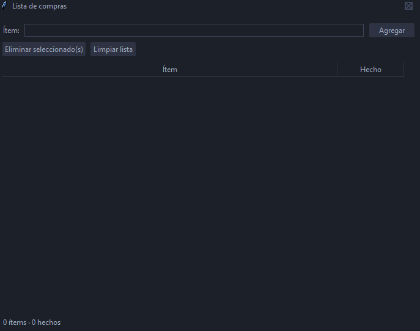

# Lista de Compras (Informatorio)

> Proyecto colaborativo de 3 personas para gestionar una lista de compras con interfaz Tkinter, siguiendo buenas prácticas de Git, ramas y Pull Requests.

## Visión general
- Lenguaje: **Python 3.13.7**.
- Interfaz actual: **Tkinter 8.6** (GUI).
- Entrada principal: **src/main.py**.
- Licencia: **MIT** (ver archivo LICENSE).
- Organización del equipo: ver Asignacion-Tareas.txt.

## Estructura actual 05/11/2025
- .gitignore
- Asignacion-Tareas.txt
- LICENSE
- README.md
- requirements.txt
- src/main.py

## Puesta en marcha

### 1) Requisitos
- **Python 3.13.7** instalado (incluye Tkinter 8.6 en instalaciones estándar de Windows/macOS).

### 2) Clonar y entrar al proyecto
```bash
git clone https://github.com/miguelrtrombotto/lista-compras-informatorio
cd lista-compras-informatorio
```

### 3) Crear y activar entorno virtual
Windows (PowerShell):
```powershell
python -m venv .venv
.venv\Scripts\Activate.ps1
```
Linux/macOS (bash):
```bash
python3 -m venv .venv
source .venv/bin/activate
```

### 4) Instalar dependencias
```bash
pip install -r requirements.txt

### 5) Ejecutar la app (Tkinter)
```bash
python src/main.py
```

## Modelo de ramas (equipo de 3)
- **main**: estable; solo se actualiza con Pull Requests.
- **feature/estructura-inicial** → Persona A.
- Otras ramas sugeridas:
  - **feature/ui-persona-b** → Persona B
  - **feature/persistencia-persona-c** → Persona C

## Flujo de trabajo
1. Actualizar main:
```bash
git switch main
git pull origin main
```

2. Crear tu rama:
```bash
git switch -c feature/<descripcion>-persona-<a|b|c>
```

3. Commits (Convencional Commits: feat, fix, docs, chore, refactor, test):
```bash
git add .
git commit -m "feat: agrega ventana principal de Tkinter con lista básica"
```

4. Push y PR:
```bash
git push -u origin feature/<...>
```
- En GitHub: base = main, compare = tu feature.
- Completar título, descripción y pasos para probar.

5. Mantener tu rama al día:
- Rebase (historial limpio):
```bash
git switch main && git pull
git switch feature/<...>
git rebase main
git push --force-with-lease
```
- o Merge:
```bash
git switch main && git pull
git switch feature/<...>
git merge main
git push
```

## Reglas de protección (recomendadas)
- Require a pull request before merging: activado.
- Required reviews: 1.
- Required status checks (si hay CI): opcional.
- Require conversation resolution: opcional.
- Require branches to be up to date: opcional (si bloquea, desactivar).
- Include administrators: desactivado (para evitar bloqueos si falta un revisor).

## Capturas (opcional)
- Guardar imágenes en `docs/images/` y referenciarlas así:
```

```
- Sugeridas: ventana principal, agregar/editar/eliminar ítems, marcar comprado/no comprado, y (si aplica) un PR con checks en verde.

## Licencia
Este proyecto está bajo la licencia **MIT**. Ver el archivo LICENSE para más detalles.

## Autores
- Persona A: Miguel R. Trombotto
- Persona B
- Persona C